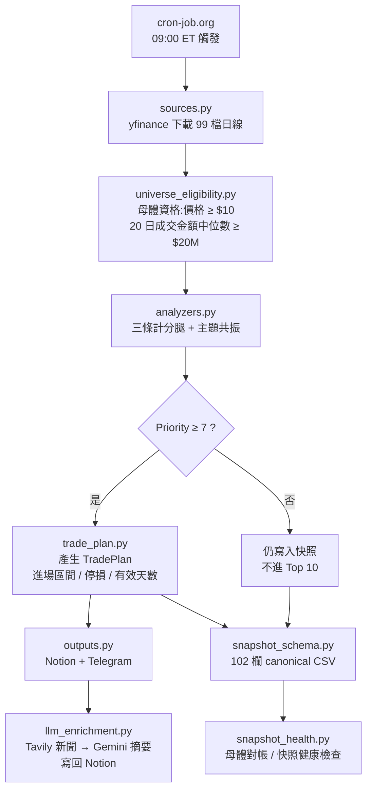

# us-stock-scanner

Nasdaq-100 盤前掃描系統。每個交易日 09:00 ET 對 99 檔成分股評分,產出交易計畫,
推播到 Telegram、寫入 Notion,並把整份母體封存成不可變快照供日後校準。

**目前處於校準期。** 系統會產生交易計畫,但參數尚未經過美股資料驗證 ——
所有權重與門檻都是從台股版移植而來的初始值。在累積足夠樣本之前,
**不得調整任何計分參數**。詳見〈調參閘門〉。

---

## 一天的流程



掃描本身**不下單、不建議部位大小**。它輸出的是「哪些標的觸發了哪條規則,
以及若要進場,進場區間與停損應該畫在哪裡」。

---

## 核心概念:選股與量測是兩件事

這是理解本系統最關鍵的一點。

| | 選股(selection) | 量測(measurement) |
|---|---|---|
| 做什麼 | 決定今天哪些標的入選、分數多少 | 事後追蹤這些標的實際表現如何 |
| 版本 | `SignalEngineVersion` = `v1.2.1` | `TradePlanVersion` / `ShadowMeasurementVersion` = `v1.3.1-shadow` |
| 身分 | `ConfigHash` = `8142e595d788ac06`<br/>`UniverseVersion` = `ndx-99-78834e47b659` | 隨量測邏輯獨立演進 |

兩者刻意分開版本,因為它們會各自改動,而**混用不同版本的樣本做統計會得出錯誤結論**。
系統在多處強制隔離:快照每列都記錄完整版本三元組,統計時只取版本完全相符的列,
其餘一律排除並計數。

### 計分腿

三條腿**互斥**,依下表順序判定,先命中者為準 —— 一檔股票同一天只會有一條腿。

| 腿別 | 分數 | 觸發條件 | 計畫錨點 |
|---|---:|---|---|
| `consolidation_dip` 盤整低接 | 10 | 位置為盤整 + 量縮 + DistTag 為甜點價 | MA60 |
| `oversold_bounce` 超賣反彈 | 7 (+1) | 位置在低檔 + RSI < 35 + 止穩<br/>(量縮為**加分項**非必要條件,+1) | 前高 |
| `healthy_pullback` 守均線拉回 | 5 | 當日低點觸及 MA20 或 MA60(容忍 +0.5%)<br/>但收盤守住且翻紅,且未「已偏離」 | 該 MA |

主題共振另加 `+3`。`Priority ≥ 7` 才進入 Top 10 推播;Top 10 上限 10 檔。

**基本面否決(D9)**:任一腿命中後,若季營收 YoY < 0 一律否決 —— 型態再好
也不給分,並記錄 `veto_reason=negative_revenue_yoy` 供週報驗證否決確實生效。
被否決者仍會寫進快照(留全池紀錄),但不進 Top 10。

> ⚠️ 上述所有數值都**未經美股校準**,是從台股版沿用的形狀。這正是校準期要解決的事。

---

## 調參閘門

系統禁止憑感覺調參。要解鎖調參,必須同時滿足:

1. **樣本數**:累積 60 筆 completed-R episode(目標 100)
2. **分層樣本**:每個分層各滿 20 筆
3. **母體一致**:整批樣本必須出自同一套 `UniverseVersion`

目前狀態(2026-08-18):**8 / 60,collecting** —— 預估 2026-10-14 達標。
週報每週會更新預估日期與區間。

### 為什麼要這麼嚴

`ConfigHash` 涵蓋所有會改變選股結果的設定。**改動其中任何一項,已累積的樣本
即刻作廢、計數歸零。** 因此校準期內:

- ❌ 不可改:計分權重、量縮門檻、RSI 門檻、`MIN_PRIORITY_FOR_GO`、
  流動性門檻、MA 週期、主題加分、time exit 天數
- ❌ 不可改:`SCAN_POOL`(成分股異動會改變主題觸發,進而改變其他股票的分數)
- ✅ 可以改:報告呈現、新聞摘要、監控、測試、文件 —— 只要不進 `ConfigHash`

`SCAN_POOL` 特別值得注意:它**不在** `ConfigHash` 內,改動它不會讓計數歸零,
卻會污染樣本。系統因此另設母體一致性閘門,偵測到混合母體時會直接禁止調參,
並要求人工決定是接受混合(需記錄理由)還是重新起算。

### 閘門開啟後

```bash
py -X utf8 -m tuning_analysis reports/shadow_episodes.csv
```

`tuning_analysis.py` 做分層統計,並刻意把結論分成兩層:探索層(未校正)只能
產生假說,確認層(Bonferroni 校正)才是結論。多數情況確認層會是空的 ——
那是答案,不是缺陷。工具會一併算出「還需要多少樣本才解析得動」。

---

## 檔案地圖

### 掃描主線
| 檔案 | 職責 |
|---|---|
| `main.py` | 主流程編排:下載 → 評分 → 計畫 → 輸出 → 封存 |
| `config.py` | 所有參數的單一來源 |
| `sources.py` | yfinance 封裝、交易日曆、盤前報價、季營收 cache |
| `analyzers.py` | 計分腿、主題共振、大盤環境判斷 |
| `universe_eligibility.py` | 母體資格與排除原因碼 |
| `trade_plan.py` | TradePlan 產生;`strategy_config_hash()` 定義 cohort 身分 |
| `outputs.py` | Notion 同步與 Telegram 推播 |
| `llm_enrichment.py` | Tavily 新聞 → Gemini 摘要 → 寫回 Notion(P7.5) |

### 快照與健康
| 檔案 | 職責 |
|---|---|
| `snapshot_schema.py` | 102 欄 canonical CSV 契約,原子寫入與驗證 |
| `snapshot_metadata.py` | 快照時點與成交日推導 |
| `snapshot_health.py` | 每日健康檢查:母體對帳、SHA、報價狀態 |

### 量測與校準
| 檔案 | 職責 |
|---|---|
| `execution_measurement.py` | 純函式量尺:成交判定與 R 區間計算 |
| `track_shadow_performance.py` | 從歷史快照重算 shadow 績效 |
| `episode_analysis.py` | 把每日重複訊號折疊成 episode,計算成熟度 |
| `build_shadow_episodes.py` | 產生 episode 與成熟度產物 |
| `gate_projection.py` | 閘門達標日預估 |
| `tuning_analysis.py` | 分層統計與多重比較防護(閘門開啟後使用) |
| `track_performance.py` | Notion legacy-v0 績效回填 |
| `weekly_report.py` | 週報彙總、閘門判定、永久歸檔 |

---

## 產物

| 位置 | 內容 |
|---|---|
| Notion `📈 美股掃描` DB | 每日精選標的、進場參考、停損、LLM 摘要、事後 R 回填 |
| Telegram | 每日盤前推播、每週校準週報 |
| `reports/daily/*.csv` | 每個交易日的完整母體快照(永久保存) |
| `reports/weekly/*.{md,json}` | 每週報告 |
| `reports/latest.{md,json}` | 最新一份週報 |
| `reports/shadow_*.{csv,json,md}` | shadow 績效、episode 與成熟度 |

`reports/` 由 workflow 自動 commit。快照是**不可變**的:較晚的失敗補跑不會
覆蓋同日已成功的盤前快照。

---

## 排程

| Workflow | 觸發 | 說明 |
|---|---|---|
| `scan.yml` | cron-job.org 打 `workflow_dispatch`,週一至五 09:00 ET | GitHub `schedule` 實測會漏跑,故改外部觸發 |
| `scan_watchdog.yml` | `schedule` 13:15 / 13:20 UTC | 主觸發缺跑或失敗才補 dispatch |
| `weekly_report.yml` | 每週日 | 先歸檔本週快照、重算 episode,再產週報 |
| `seed_revenue.yml` | 每週六 13:00 UTC | 更新季營收 cache |

程式內另有時窗護欄:`main.py` 只在 08:30–09:30 ET 寫 Notion,窗外需明確
勾選 `force_notion_sync`。休市日不掃描。

---

## 開發

```bash
# 全套測試(239 項)
py -X utf8 -m unittest discover -s tests -p "test_*.py"

# 單一模組
py -X utf8 -m unittest tests.test_trade_plan
```

Windows note:一律用 `py -X utf8`。`python` 可能指向 Microsoft Store 空殼;
cp950 預設編碼會讓含 emoji 的 print 拋 `UnicodeEncodeError`。

### 改動前的自我檢查

```bash
# 確認你的改動沒有動到 cohort 身分
py -X utf8 -c "from trade_plan import strategy_config_hash, universe_version; print(strategy_config_hash(), universe_version())"
```

改動前後這兩個值必須相同,除非你**刻意**要重啟校準週期並已取得同意。

### 協作規範

- `git commit` 與 `push` 每一次都需要專案擁有者明確同意。
- 議題追蹤在 `.scratch/<feature>/`(spec + issues + map),與程式一起 commit。
- 詳細規範見 `AGENTS.md` 與 `docs/agents/`。

---

## 現況速查(2026-08-18)

| 項目 | 值 |
|---|---|
| SignalEngine | `v1.2.1` |
| TradePlan / Measurement | `v1.3.1-shadow` |
| Snapshot schema | `v1.3.3`(102 欄) |
| ConfigHash | `8142e595d788ac06` |
| UniverseVersion | `ndx-99-78834e47b659` |
| 調參閘門 | 8 / 60(collecting),預估 2026-10-14 達標 |
| 測試 | 239 項 |

歷史沿革與每批改動的證據鏈見 `PROGRESS_*.md`。
